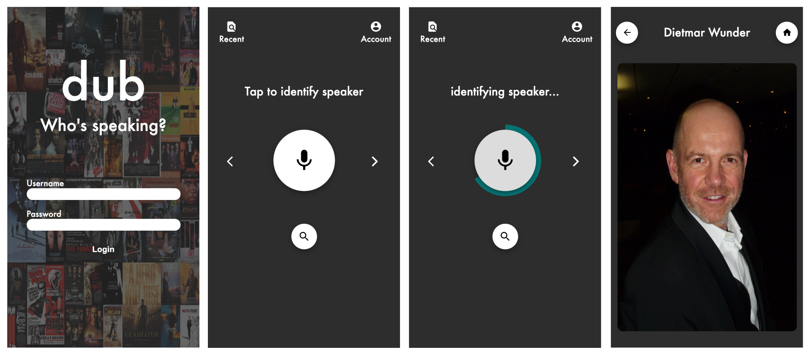

# dub - Who's speaking?

#### Mein Gesellenstück welches ich im Rahmen des Java-Entwickler Bootcamps der neuefische GmbH erarbeitet habe.

*"Als Synchronisation, Synchronisierung oder Dubbing bezeichnet man in der Filmproduktion das Herstellen eines zeitlichen Gleichlaufs zwischen Bild und Ton." (https://de.wikipedia.org/wiki/Synchronisation_(Film))*

## Die App

Bei dub handelt es sich um eine Full-Stack Web App um den Synchronsprecher hinter einer Filmfigur zu erkennen. Die App ermöglicht es den Synchronsprecher mithilfe einer Spracherkennung zu identifizieren. Alternativ ist es dem User möglich den Schauspieler über eine Gesichtserkennung zu erkennen. Im Anschluss lässt sich dann die Identität des Synchronsprechers, über den Zugriff auf eine Datenbank, ermitteln.

